# Youth-Sakti-Social-Foundation

## NGO Website — Finalized Modern Tech Stack

> **A modern NGO ecosystem platform that connects Volunteers, Donors, NGO Partners, and Admins through a single, transparent, role-based web experience.**

---

## 📚 What's In This README

This README is written for a very young student. Every section explains one thing at a time, uses friendly words, and pairs the explanation with a **diagram** you can copy into a Mermaid renderer (GitHub renders Mermaid automatically).

- 🤖 What does the project actually do?
- 🏛️ How is the **whole system** put together? (system architecture)
- 🎨 How does the **frontend** work? (what a user sees)
- ⚙️ How does the **backend** work? (the brain behind the screen)
- 🗄️ How does the **database** work? (where everything is remembered)
- 🌐 How does the **infrastructure** work? (how it all gets delivered to the world)
- 🧑‍💻 Step-by-step **workflows** for the most important user journeys
- 🤖 Where is the **"AI pipeline"?** (an honest answer — and what we have instead)

---

# 🤖 What Does The Project Actually Do?

Imagine an **NGO** (Non-Governmental Organization) that wants to plant trees, run blood donation camps, and teach kids. This website helps them do all of that **online**.

| Who | What they can do |
|---|---|
| **Visitor** | Browse the homepage, read the blog, see events, look at the gallery. No account needed. |
| **Volunteer** | Sign up, register for events, see their impact score. |
| **Donor** | Sign up, donate money to a campaign, see donation history, download receipts. |
| **NGO Partner** | Sign up, propose campaigns and events, get verified by an admin. |
| **Admin** | Manage users, approve NGOs, edit campaigns, read contact messages, see analytics. |

The platform is **role-based**: the website changes what it shows you based on **who you are**.

---

# 🏛️ How Is The Whole System Put Together?

Below is a top-level picture of the whole YSSF system. Every user is in their browser (laptop or phone), the frontend runs in the cloud, the backend runs in another cloud, and the database remembers everything.

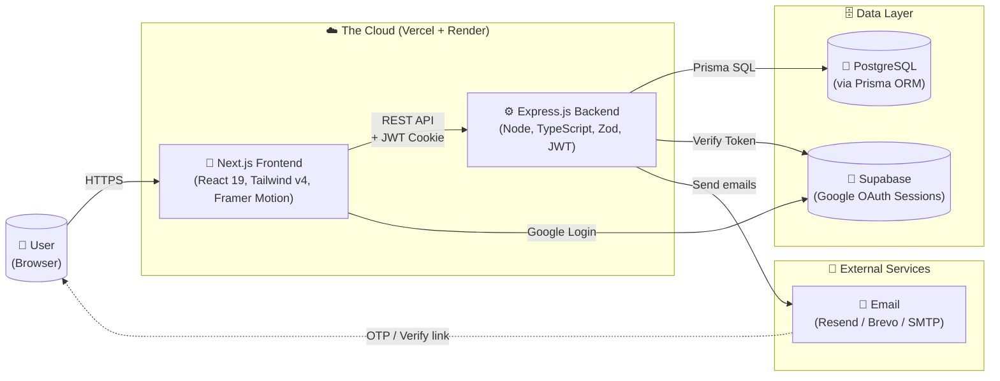

> **Kid-friendly explanation:** Think of a sandwich. The top slice of bread is the **Frontend** (the pretty screen the user touches). The middle is the **Backend** (the smart brain that decides what to do). The bottom slice is the **Database** (a giant notebook that remembers everything).

---

# 🎨 How Does The Frontend Work?

The frontend is the part of the website the user actually sees. We built it with **Next.js** (a popular React framework) and we use **Tailwind CSS** (a tool that lets us style things by writing short class names).

## Frontend Architecture (Big Picture)

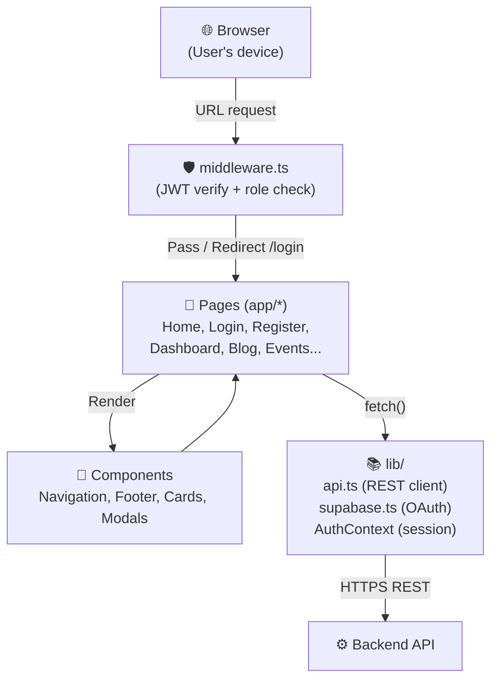

## Frontend Folder Map

| Folder | What it does |
|---|---|
| `src/app/` | The pages. Each folder is a URL. `app/login/page.tsx` = the login page. |
| `src/components/` | Reusable pieces. `Navigation.tsx` is the top bar on every page. |
| `src/lib/api.ts` | A typed REST client. Every API call goes through here. |
| `src/lib/supabase.ts` | The Google OAuth helper. |
| `src/lib/context/AuthContext.tsx` | Keeps the current user in memory across the whole app. |
| `src/middleware.ts` | Runs **before** any page. Checks the JWT and gates `/dashboard/*`. |

## How a Page Loads (Step by Step)

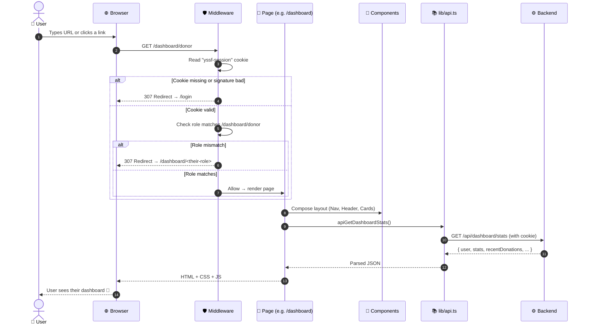

---

# ⚙️ How Does The Backend Work?

The backend is the **brain**. The frontend asks it questions, and it answers. The brain lives in `backend/src/` and is written in **TypeScript** with **Express 5**.

## Backend Architecture (Big Picture)

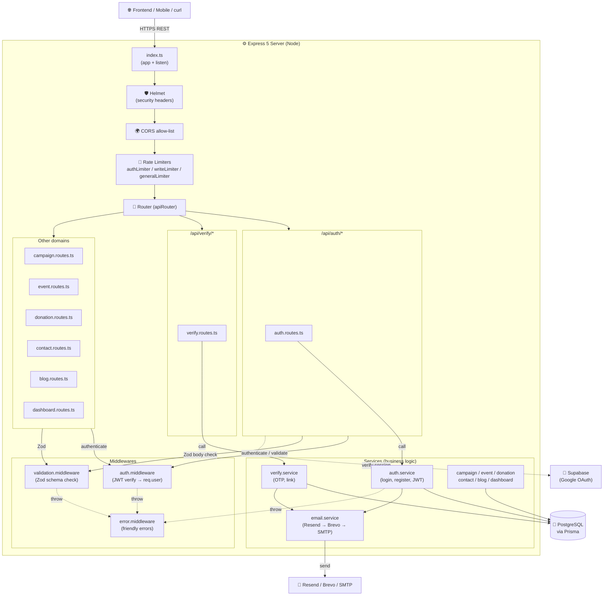

## Backend Folder Map

| File / Folder | What it does |
|---|---|
| `src/index.ts` | The entry point. Boots Express, mounts middleware, listens on `PORT`. |
| `src/config/env.ts` | Validates `.env` variables with Zod. App refuses to start if any are missing. |
| `src/middlewares/auth.middleware.ts` | Reads the `yssf-session` cookie, verifies the JWT, loads the user from DB, sets `req.user`. |
| `src/middlewares/validation.middleware.ts` | Runs a Zod schema on `req.body` / `req.query` / `req.params`. |
| `src/middlewares/rate-limiter.middleware.ts` | Three limiters: `authLimiter` (login/signup), `writeLimiter` (donate, register, contact), `generalLimiter` (everything). |
| `src/middlewares/error.middleware.ts` | Catches all errors at the end and turns them into friendly JSON responses. |
| `src/controllers/*` | Thin HTTP layer. Parses the request, calls a service, sends the response. |
| `src/services/*` | The actual business logic (create a user, send an OTP, etc.). |
| `src/utils/prisma.ts` | A shared `PrismaClient` instance. |
| `src/utils/errors.ts` | Custom error classes: `BadRequestError`, `UnauthorizedError`, etc. |
| `src/validators/*` | Zod schemas for every request body. |
| `src/routes/*` | Wire each URL pattern to its controller + middlewares. |
| `prisma/schema.prisma` | The database schema (the shape of every table). |
| `prisma/seed.ts` | Populates the DB with demo campaigns, events, blog posts, and a test user. |

## How a Request Flows Through The Backend

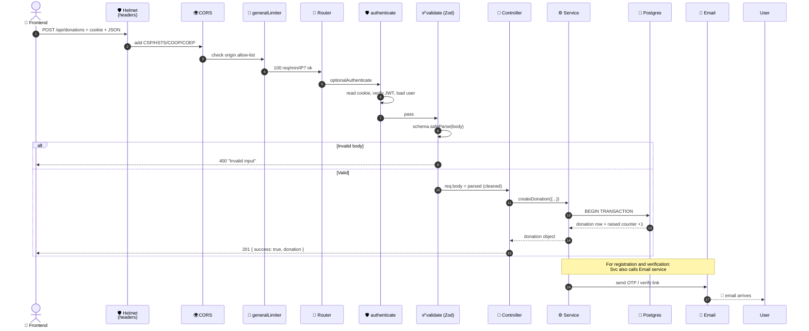

## Authentication Pipeline (the "session" story)

```mermaid
sequenceDiagram
    autonumber
    actor U as 👤 User
    participant FE as 🎨 Frontend
    participant BE as ⚙️ Backend
    participant DB as 🐘 Postgres
    participant SB as 🔐 Supabase

    Note over U,SB: Path A: Email + Password
    U->>FE: type email + password
    FE->>BE: POST /api/auth/login
    BE->>DB: find user by email
    DB-->>BE: row
    BE->>BE: bcrypt.compare(password, hash)
    alt wrong password
        BE-->>FE: 401 "Invalid email or password"
    else correct
        BE->>BE: generate JWT (HS256, 2h, JWT_SECRET)
        BE-->>FE: 200 + Set-Cookie: yssf-session=...;<br/>HttpOnly; SameSite=Strict; Path=/
        FE-->>U: dashboard renders

    Note over U,SB: Path B: Google OAuth
    U->>FE: click "Sign in with Google"
    FE->>SB: supabase.auth.signInWithOAuth("google")
    SB-->>U: Google login popup
    U->>SB: approves
    SB-->>FE: /auth/callback with session.access_token
    FE->>BE: POST /api/auth/google-supabase<br/>{ supabaseToken, email, name }
    BE->>SB: GET /auth/v1/user (server-side verify)
    SB-->>BE: { id, email, user_metadata }
    BE->>BE: require email matches the verified one
    BE->>DB: upsert user (emailVerified=true)
    BE->>BE: generate JWT
    BE-->>FE: 200 + Set-Cookie
    FE-->>U: dashboard renders
    end
```

## Rate Limiter Strategy (the "flood control" story)

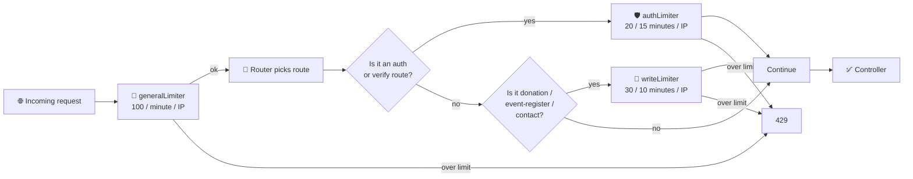

> **Kid-friendly explanation:** Rate limiters are like a bouncer at a club door. Even if the line is huge, only 100 people get in per minute. The bad guys can't flood the door.

## Error Handling Pipeline (the "no scary stack traces" story)

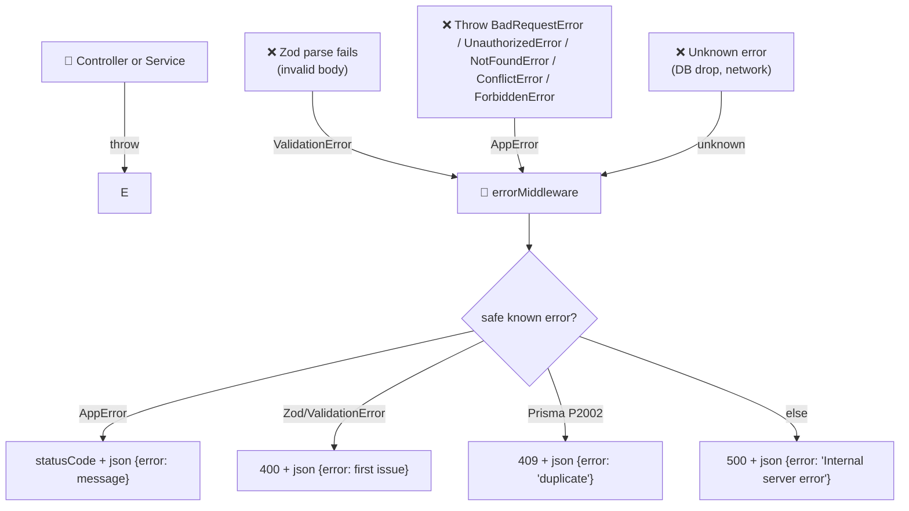

---

# 🗄️ How Does The Database Work?

We use **PostgreSQL** (a strong, popular database). We talk to it using **Prisma**, a tool that lets us write our queries in TypeScript and not raw SQL.

## Entity-Relationship Diagram

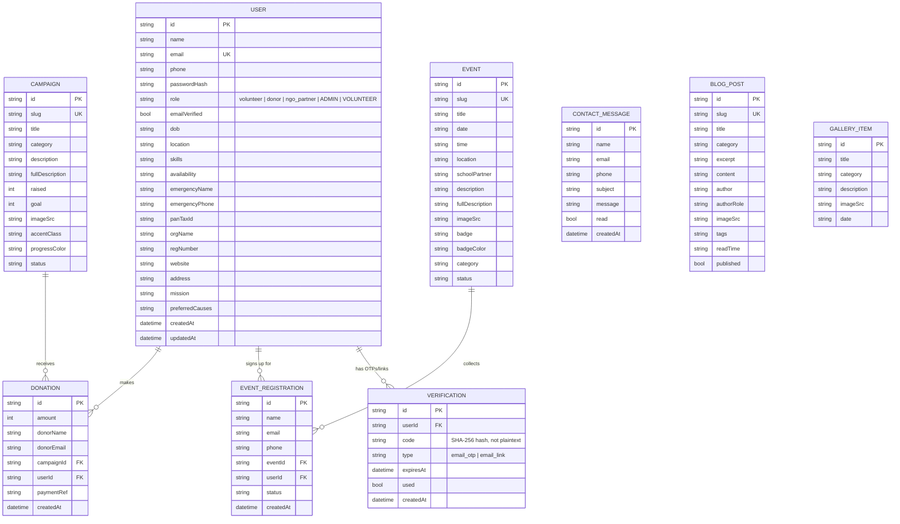

## How Prisma Talks to Postgres (the "translator" story)

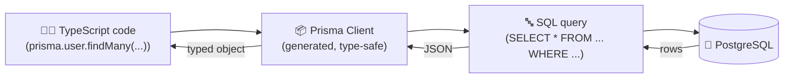

## Database Migration Story (the "schema change" story)

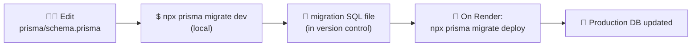

> **Important security note:** The `Verification.code` column stores a **SHA-256 hash**, not the live OTP. So a leaked database does **not** leak live OTPs. This is one of 20 fixes from the security audit (M-1).

---

# 🧑‍💻 Step-By-Step Workflows (The Most Important User Journeys)

These are the **stories** of the most common things a user does on the site. They show every step, from the user clicking a button to the database being updated.

## 1. User Registration Workflow

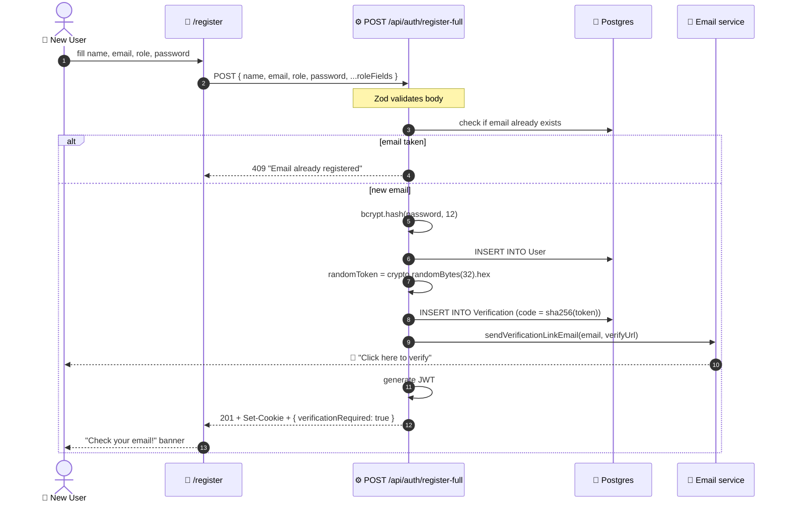

## 2. Email Verification Workflow (click-the-link story)

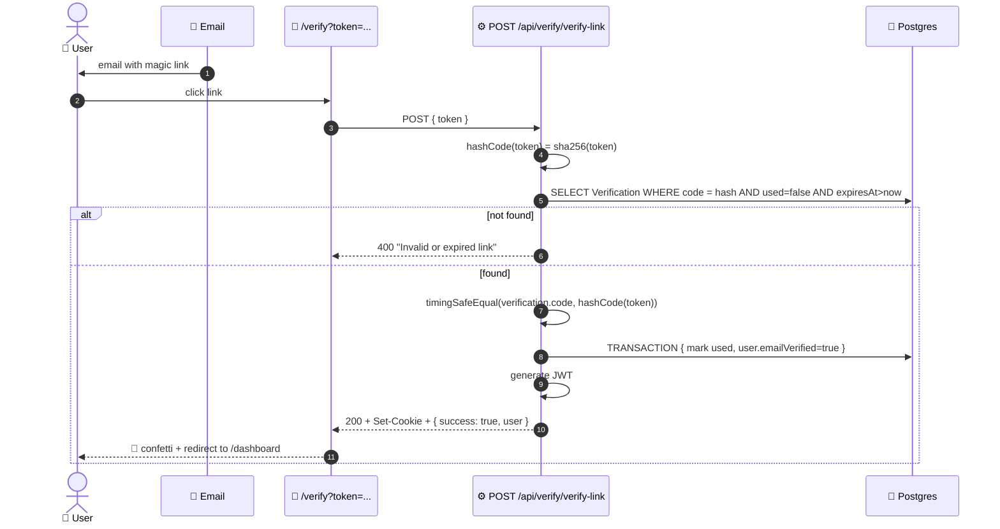

## 3. Login Workflow

```mermaid
sequenceDiagram
    autonumber
    actor U as 👤 User
    participant FE as 🎨 /login
    participant BE as ⚙️ POST /api/auth/login
    participant DB as 🐘 Postgres

    U->>FE: email + password
    FE->>BE: POST /api/auth/login
    BE->>DB: find user by email
    alt user not found or hash missing
        BE-->>FE: 401 "Invalid email or password"
    else user found
        BE->>BE: bcrypt.compare(password, hash)
        alt wrong password
            BE-->>FE: 401 "Invalid email or password"
        else correct
            BE->>BE: generate JWT (HS256, 2h)
            BE-->>FE: 200 + Set-Cookie: yssf-session=...;<br/>HttpOnly; SameSite=Strict; Path=/
            Note over FE: Browser stores HttpOnly cookie.<br/>JS cannot read it (XSS-safe).
            alt emailVerified=false
                FE-->>U: warning: "Please verify your email"
            else emailVerified=true
                FE-->>U: redirect to /dashboard/<role>
            end
        end
    end
```

## 4. Donation Workflow

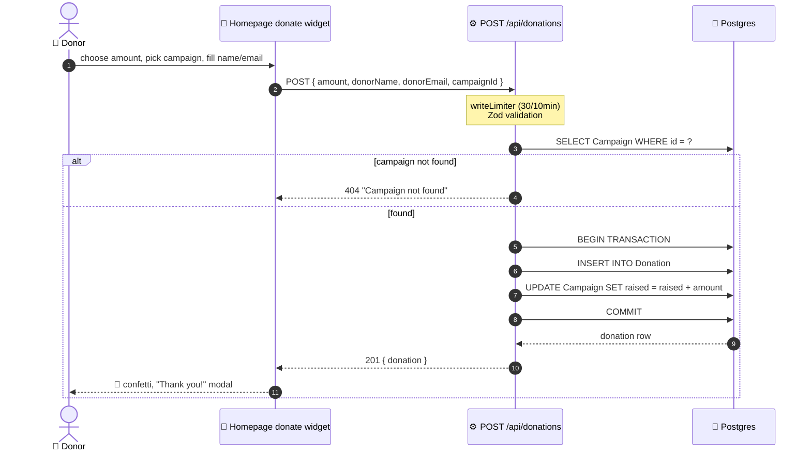

## 5. Event Registration Workflow

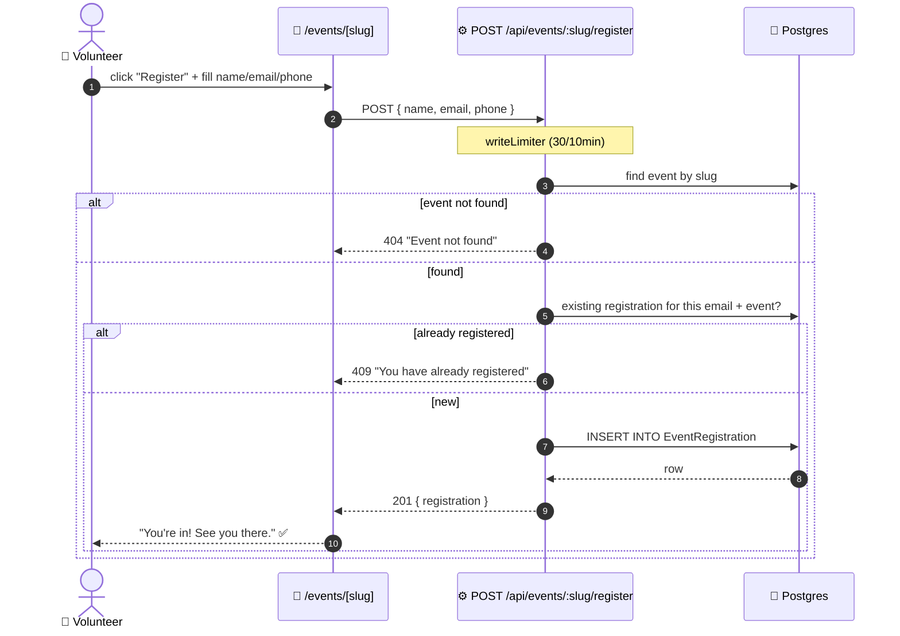

## 6. Contact Form Workflow

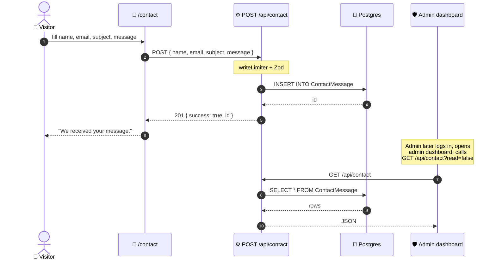

## 7. Admin Manages Users Workflow

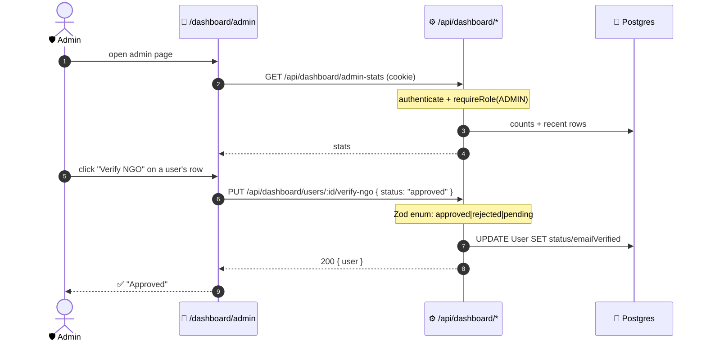

---

# 🤖 Where Is The "AI Pipeline"?

**Honest answer:** The YSSF project **does not contain an AI / ML / LLM pipeline today**.

We searched the source code (`backend/src`, `frontend/src`, `prisma/`, configs) and there is no model file, no `openai` / `anthropic` / `huggingface` dependency, no inference endpoint, no vector store, no embeddings, no recommendation engine. The `package.json` files confirm it: the only third-party service integrations are **Supabase** (auth), **Resend / Brevo / SMTP** (email), and **PostgreSQL** (data).

So what people sometimes call "pipelines" in this project are the **automation pipelines** — strict, deterministic, no-AI workflows that move data around and send messages. We have **four** of them:

## Pipeline 1: Email Pipeline (transactional, multi-provider failover)

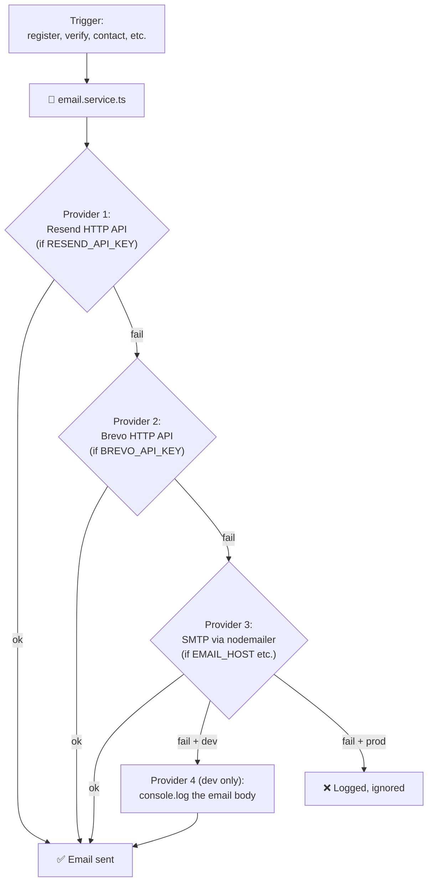

> **Kid-friendly explanation:** It's like having **four mail carriers**. We give the package to the first one. If they say "I'm busy," we give it to the second, and so on. The first one that says "OK, sent it" wins.

## Pipeline 2: OTP / Verification Link Pipeline

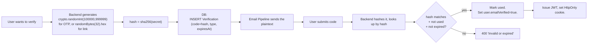

> **Kid-friendly explanation:** We never store the secret itself. We store its **fingerprint** (a hash). So even if someone steals the database, they can't fake the secret.

## Pipeline 3: Dev Quick-Login Pipeline (development-only helper)

```mermaid
flowchart LR
    A["Dev clicks 'Quick login' in /login"]
    B["POST /api/auth/dev-quick-login { role }"]
    C{"NODE_ENV=='production'<br/>OR SEED_DEV_LOGIN != '1'?"}
    D["404 Not Found"]
    E["Find seeded user by role"]
    F["Generate per-process random password<br/>(or use SEED_DEV_LOGIN_PASSWORD)"]
    G["Return { email, password }"]
    H["Frontend calls /api/auth/login with those"]

    A --> B --> C
    C -- yes --> D
    C -- no  --> E --> F --> G --> H
```

> **Kid-friendly explanation:** In real life, we never embed passwords in the website. In dev, we want a fast way to log in. This pipeline only exists when the operator opts in (`SEED_DEV_LOGIN=1`) and is **disabled in production**.

## Pipeline 4: Donation Payment Pipeline (simulated)

```mermaid
flowchart LR
    A["Donor fills donate form"]
    B["POST /api/donations"]
    C["writeLimiter + Zod"]
    D["DB transaction:<br/>INSERT donation + UPDATE campaign.raised"]
    E["paymentRef = 'SUCCESS-<timestamp>'"]
    F["201 { donation }"]
    G["🎉 confetti"]

    A --> B --> C --> D --> E --> F --> G
```

> **Note:** The current build uses a **simulated** payment (the `paymentRef` is auto-generated and the UI shows a Razorpay-simulated checkout modal in some flows). To plug in a real gateway later, the only file that needs to change is the donation service: replace the simulated success with a call to the gateway's `create-order`, `verify-signature`, and a webhook. The rest of the pipeline stays the same.

## "What would an AI pipeline look like in the future?" (placeholder)

If/when an AI feature is added, the recommended shape is:

```mermaid
flowchart LR
    UI["🎨 Frontend (chat / form)"]
    API["⚙️ /api/ai/* (Express)"]
    GW["🤖 Model Gateway<br/>(OpenAI / Anthropic / local)"]
    Cache["🗄️ Redis cache<br/>(dedupe + rate-limit)"]
    DB[("🐘 Postgres<br/>(audit log)")]
    Guard["🛡️ Guardrails<br/>(length cap, PII redaction,<br/>topic allow-list)"]

    UI --> API
    API --> Guard
    Guard --> Cache
    Guard --> GW
    GW --> Guard
    Guard --> API
    API --> DB
    API --> UI
```

> **Why this shape?** Every AI call goes through the **backend**, not the browser — so the API key never reaches the user. The **guardrails** filter and cap the output. The **cache** makes repeat questions cheap. The **audit log** is a regular Postgres table so we can prove the model never leaked PII.

---

# 🌐 How Does The Infrastructure Work? (How It Gets Delivered To The World)

## Local Development (docker-compose)

```mermaid
flowchart TB
    Dev["🧑‍💻 Developer"]
    DC["🐳 docker-compose up"]
    FE["🎨 frontend container<br/>localhost:3000"]
    BE["⚙️ backend container<br/>localhost:3001"]
    PG[("🐘 postgres:16-alpine<br/>container")]

    Dev --> DC
    DC --> FE
    DC --> BE
    DC --> PG
    FE -- "NEXT_PUBLIC_API_URL=http://localhost:3001" --> BE
    BE -- "DATABASE_URL" --> PG
```

## Production (Render + Vercel)

```mermaid
flowchart TB
    User["👤 User on the internet"]
    Vercel["▲ Vercel<br/>(hosts the Next.js frontend)"]
    Render["🟦 Render<br/>(hosts the Express backend)"]
    PGdb[("🐘 Render Postgres<br/>(managed)")]
    GHub[("📦 GitHub<br/>(source of truth)")]

    User -- "HTTPS" --> Vercel
    Vercel -- "REST + cookie" --> Render
    Render -- "Prisma SQL" --> PGdb
    GHub -- "git push main" --> Render
    GHub -- "git push main" --> Vercel

    subgraph GH["GitHub Actions CI"]
        T1["backend:<br/>npm ci + prisma generate + npm test + npm run build"]
        T2["frontend:<br/>npm ci + npm run build"]
    end
    GHub --> GH
```

## Deployment Sequence (the "git push to live" story)

```mermaid
sequenceDiagram
    autonumber
    actor Dev as 🧑‍💻 Developer
    participant GH as 📦 GitHub
    participant CI as 🧪 GitHub Actions
    participant V as ▲ Vercel
    participant R as 🟦 Render
    participant DB as 🐘 Postgres

    Dev->>GH: git push origin main
    GH-->>CI: trigger workflow
    CI->>CI: backend: install + prisma generate + test + build
    CI->>CI: frontend: install + build
    alt CI fails
        CI-->>Dev: ❌ red check
    else CI passes
        CI-->>Dev: ✅ green check
        GH-->>V: webhook → redeploy
        GH-->>R: webhook → redeploy
        R->>R: build: npm ci + npx prisma generate + npm run build
        R->>R: start: npx prisma migrate deploy && node dist/index.js
        R->>DB: run migration SQL
        DB-->>R: schema updated
        R-->>R: app listening on :3001
        V-->>V: build + deploy Next.js
        V-->>Dev: ✅ live
    end
```

---

# 🛡️ Security Workflow (the "trust, but verify" story)

A summary of the defense layers a hacker would have to bypass. (For the full audit, see `SECURITY_AUDIT_REPORT_2026-06-15.md`.)

```mermaid
flowchart TB
    Hacker["🕵️ Attacker"]
    H1["🚦 Rate Limiters<br/>(writeLimiter, authLimiter)"]
    H2["🌍 CORS allow-list"]
    H3["🛡️ Helmet headers<br/>(CSP, HSTS, COOP, COEP, CORP)"]
    H4["🛡️ Middleware JWT verify<br/>(HS256, strict signature)"]
    H5["🛡️ requireRole(['ADMIN'])<br/>(role-based access)"]
    H6["✅ Zod validation<br/>(body, query, params)"]
    H7["🔐 sha256 + timingSafeEqual<br/>(OTP / verification link)"]
    H8["🍪 HttpOnly + SameSite=Strict<br/>(session cookie)"]
    H9["🚨 errorMiddleware<br/>(no stack traces leak)"]
    H10["📦 Supabase server-side verify<br/>(Google OAuth)"]

    Hacker --> H1
    H1 -- "ok" --> H2
    H2 -- "ok" --> H3
    H3 -- "ok" --> H4
    H4 -- "ok" --> H5
    H5 -- "ok" --> H6
    H6 -- "ok" --> H7
    H7 -- "ok" --> H8
    H8 -- "ok" --> H9
    H9 -- "ok" --> H10
    H1 -- "spam" --> S1["429 rate limit"]
    H2 -- "wrong origin" --> S2["CORS error"]
    H3 -- "XSS payload" --> S3["CSP block"]
    H4 -- "forged token" --> S4["redirect /login"]
    H5 -- "wrong role" --> S5["403 Forbidden"]
    H6 -- "bad body" --> S6["400 Invalid input"]
    H7 -- "wrong code" --> S7["400 Bad request"]
    H8 -- "XSS read" --> S8["cookie unreadable from JS"]
    H9 -- "Prisma error" --> S9["500 generic message"]
    H10 -- "fake email" --> S10["401 Supabase mismatch"]
```

---

# 📋 Suggested Folder Structure

```txt
yssf/
├── backend/
│   ├── src/
│   │   ├── config/         # env.ts (Zod-validated config)
│   │   ├── controllers/    # HTTP layer
│   │   ├── middlewares/    # auth, validation, rate-limit, error
│   │   ├── routes/         # URL → controller wiring
│   │   ├── services/       # business logic
│   │   ├── tests/          # node:test unit tests
│   │   ├── utils/          # errors, prisma
│   │   ├── validators/     # Zod schemas
│   │   └── index.ts        # entry
│   ├── prisma/
│   │   ├── schema.prisma
│   │   └── seed.ts
│   ├── Dockerfile
│   ├── start.sh
│   └── package.json
├── frontend/
│   ├── src/
│   │   ├── app/            # Next.js pages (one folder per URL)
│   │   ├── components/     # Reusable UI
│   │   ├── lib/
│   │   │   ├── api.ts      # typed REST client
│   │   │   ├── supabase.ts # OAuth helper
│   │   │   └── context/    # AuthContext
│   │   └── middleware.ts   # gate /dashboard/*
│   ├── next.config.ts      # CSP, HSTS, etc.
│   ├── Dockerfile
│   └── package.json
├── docker-compose.yml
├── render.yaml
├── .github/workflows/ci.yml
├── README.md               # ← you are here
├── DESIGN.md               # design system
└── SECURITY_AUDIT_REPORT_2026-06-15.md
```

---

# 🚀 Development Philosophy

This technology stack is designed to provide:

- High Performance (Vercel edge + standalone Next.js)
- Modern Scalable Architecture (Express 5 + Prisma 7 + PostgreSQL)
- Strong Security (HttpOnly cookies, hashed OTPs, strict CSP, Zod-everywhere)
- Accessibility Compliance (focus rings, ARIA labels, semantic HTML)
- SEO Optimization (Next.js metadata API, prerendered pages)
- Smooth User Experience (Framer Motion, confetti, soft animations)
- Clean Developer Workflow (TypeScript end-to-end, typed REST client)
- Long-Term Maintainability (Zod schemas, role-based middlewares, audit logs)

The architecture balances startup-level scalability with NGO-focused usability and transparency.

---

# 🌟 Platform Vision

Youth-Sakti-Social-Foundation is designed as a modern NGO Ecosystem Platform that connects:

- Volunteers
- Donors
- NGO Partners
- Administrators
- Communities

through a centralized digital platform focused on:

- Social impact
- Transparency
- Community engagement
- Event management
- Donation systems
- Real-time participation

---

# 🎯 Main Product Goals

| Goal | Purpose |
|---|---|
| Community Building | Connect volunteers and NGOs |
| Transparency | Public trust through reports and analytics |
| Donation Management | Seamless event-based donations |
| Event Coordination | Organize NGO activities efficiently |
| Awareness | Showcase ongoing social impact |
| Scalability | Future-ready architecture |
| Accessibility | Inclusive platform design |
| Performance | Fast and responsive user experience |

---

# 🧭 Core Platform Philosophy

```txt
Frontend = Experience
Backend  = Support System
Database = Memory
```

The platform follows a:
- Frontend-first architecture
- Minimal backend complexity
- Strict type safety end-to-end
- Scalable managed-service ecosystem

---

# 👥 User Roles Architecture

| Role | Responsibilities |
|---|---|
| Visitor | Browse the public site (no account). |
| Volunteer | Sign up, register for events, see impact. |
| Donor | Sign up, donate, see history and receipts. |
| NGO Partner | Sign up, propose campaigns, get verified by admin. |
| Admin | Manage users, approve NGOs, moderate content. |

---

# 🔐 Authentication Providers

| Method | Usage |
|---|---|
| Google OAuth (Supabase) | Fast onboarding, server-side verified |
| Email + Password (bcrypt) | Standard, JWT cookie session |
| Email Verification Link | 24h single-use SHA-256-hashed token |
| 6-digit Email OTP | 10-min single-use SHA-256-hashed code |

---

# 🗃️ Database Design Overview

| Table | Purpose |
|---|---|
| `User` | User accounts (admin / volunteer / donor / ngo_partner) |
| `Verification` | One-time email OTPs and verification links (hashed) |
| `Campaign` | Fundraising campaigns |
| `Event` | Volunteer events / camps |
| `Donation` | Donor contributions to campaigns |
| `EventRegistration` | Volunteer sign-ups to events |
| `ContactMessage` | Messages from the contact form |
| `BlogPost` | Articles / news |
| `GalleryItem` | Photos with caption and category |

---

# ⚡ Performance Optimization

| Feature | Purpose |
|---|---|
| Lazy Loading | Faster page rendering |
| Image Optimization | Reduced load times (`next/image`) |
| Edge Delivery | Faster media serving on Vercel |
| SSR/SSG | SEO + performance |
| Code Splitting | Better scalability |

---

# 🛡️ Security Architecture (summary)

| Feature | Purpose |
|---|---|
| HttpOnly + SameSite=Strict + Secure cookie | XSS-resistant session |
| HS256 JWT (2h) | Stateless session |
| bcrypt (cost 12) | Password hashing |
| SHA-256 + timingSafeEqual | OTP / verification token storage |
| Zod validation everywhere | Strict input contracts |
| Rate limiters (auth / write / general) | Spam and credential-stuffing defense |
| Helmet + CSP + HSTS + COOP/COEP/CORP | Browser-side hardening |
| Supabase server-side verify | OAuth cannot be forged |
| Env-driven seed password | No default credentials in production |

For the full 20-finding audit, see `SECURITY_AUDIT_REPORT_2026-06-15.md`.

---

# 📊 Analytics & Monitoring (planned)

| Tool | Purpose |
|---|---|
| Sentry | Error tracking |
| PostHog | User analytics |
| Vercel Analytics | Performance monitoring |

---

# 🛣️ Roadmap

- **Phase 1 — MVP** ✅ Landing, Auth, Events, Donations, Calendar, Admin, Blog.
- **Phase 2 — Community** ✅ Likes, comments, NGO partnerships, notifications, gallery.
- **Phase 3 — Advanced** 🟡 Transparency dashboards, advanced analytics, AI recommendations (see AI pipeline section above), realtime collaboration, smart notifications.

---

# 🌱 Future Scalability Vision

- AI-powered NGO recommendations
- Realtime volunteer coordination
- Mobile application
- Multi-language support
- NGO verification system (KYC)
- Blockchain transparency logs
- Live donation tracking
- AI chatbot assistant

---

# ✨ Final Product Vision

Youth-Sakti-Social-Foundation aims to become:

```txt
A scalable NGO collaboration and social impact ecosystem
focused on transparency, participation, and community-driven change.
```

---

# 💎 Core Values

- Transparency
- Accessibility
- Community
- Scalability
- Inclusivity
- Social Impact
- Trust
- Modern User Experience

---

# 📎 Appendix: How To Read The Diagrams

Every diagram in this README is **Mermaid** syntax. Mermaid is a language that turns text into pictures. You can paste any of the blocks into:

- The GitHub preview of this README (renders automatically)
- The official Mermaid editor: https://mermaid.live
- The VS Code "Markdown Preview Mermaid Support" extension

The four main diagram types used here are:

| Type | When used | Example |
|---|---|---|
| `flowchart` | Showing a process or system overview | Frontend architecture |
| `sequenceDiagram` | Showing messages between actors over time | Login flow |
| `erDiagram` | Showing database tables and their relationships | Database schema |
| `stateDiagram` | Showing different states something can be in | (not used here) |

> **Tip for young students:** If a diagram feels too big, focus on the **arrows first** (who sends what to whom) and read the **labels** second.
